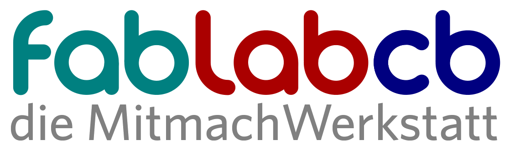
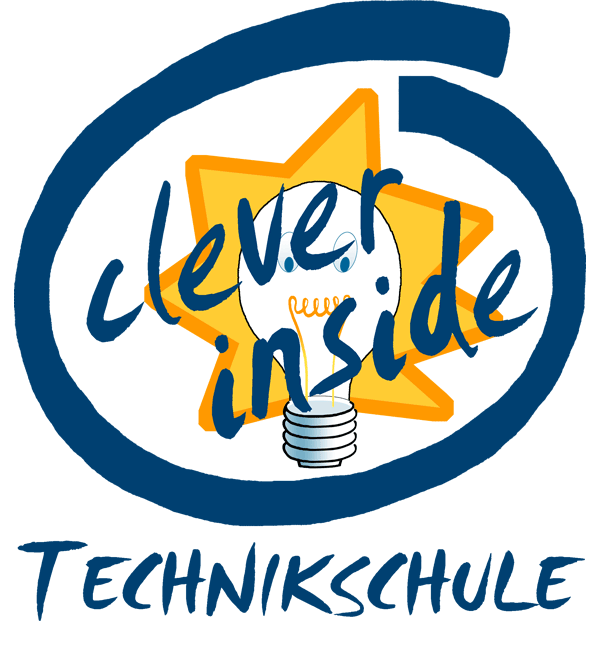
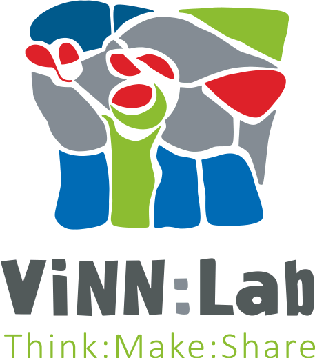

# Verbund Brandenburger offener Werkstätten

Mit der Initiative möchten wir den Austausch in Brandenburg fördern, um gemeinsame Projekte umsetzen zu können - Veranstaltungen, die auf das Angebot und die Themen aufmerksam machen oder Projekte, die uns finanzielle Unterstützung ermöglichen.

## Mitmachen 

Du bist in einer Brandenburger Werkstatt aktiv und möchtest Teil des Netzwerks werden? Über unsere [Mailingliste][join-mailing-list] erfährst du wann wir uns Treffen. Um beizutreten, schicke einfach die Mail ab, die sich nach dem Klick auf den Link öffnet. 

## Teil des Netzwerks sind:

<table>
  <tr>
    <td><a href="https://zhq.th-brandenburg.de/"    >Technische Hochschule Brandenburg</a></td>
    <td></td>
    <td></td>
    <td></td>
    <td></td>
    <td></td>
    <td></td>
  </tr>
</table>

- Brandenburg
  - [Technische Hochschule Brandenburg][thb]
- Cottbus
  - [FabLab Cottbus][fcb] (Maximilian Voigt)
- Lübbenau
  - [cleverinside][cleverinside] (Frank Thorhauer)
  - [Maker Kutsche][makerkutsche] (Frank Thorhauer)
- Potsdam
  - [Die machBar][machBar] des [Wissenschaftsladens Potsdam][wilap] (Martin Koll)
  - das [CoderDojo am HPI][cdp] (Nicco Kunzmann)
- Wildau
  - [ViNN:Lab][vinn-lab] (Patrick Grabasch)

[join-mailing-list]: mailto:&#109;&#097;&#106;&#111;&#114;&#100;&#111;&#109;&#111;&#064;&#102;&#097;&#098;&#108;&#097;&#098;&#045;&#099;&#111;&#116;&#116;&#098;&#117;&#115;&#046;&#100;&#101;?subject=subscribe&#32;brandenburger-fablab-cottbus-de&body=subscribe&#32;brandenburger-fablab-cottbus-de
[machBar]: https://machbar-potsdam.de/
[vinn-lab]: http://vinnlab.th-wildau.de/
[thb]: https://zhq.th-brandenburg.de/
[cleverinside]: http://jfvnet.de/cleverinside/
[cdp]: https://CoderDojoPotsdam.github.io/
[fcb]: http://fablab-cottbus.de
[makerkutsche]: https://makerkutsche.de/
[wilap]: http://www.wissenschaftsladen-potsdam.de/
